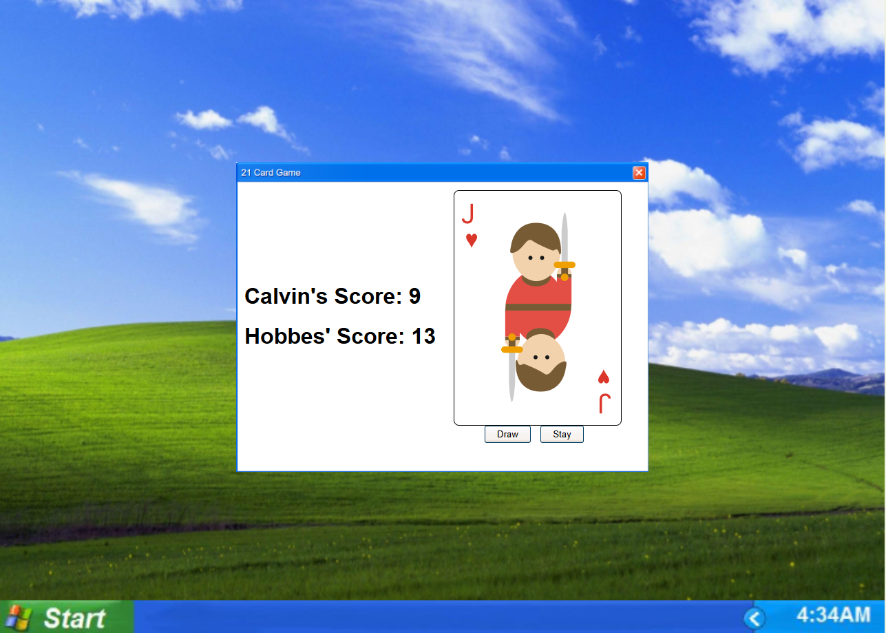
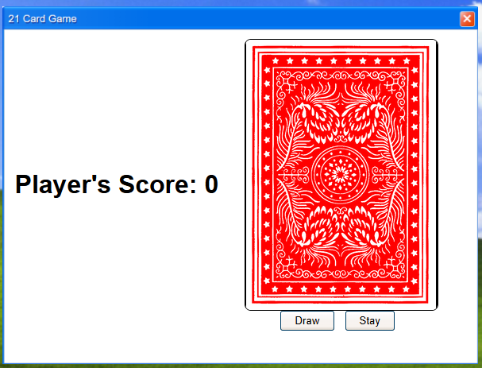
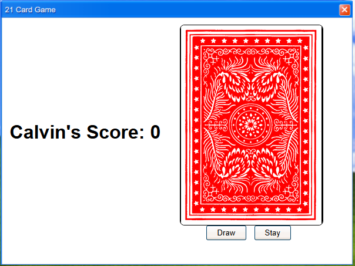
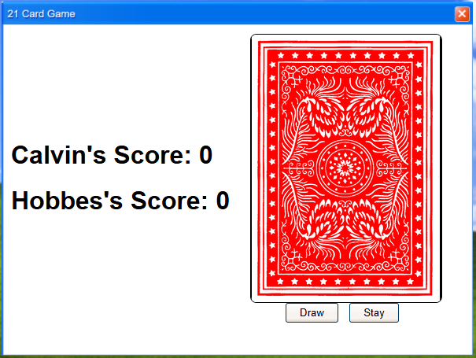

# Draw21

> Create your own draw-21 game using the power of variables and if statements!



## Table of Contents

- [Introduction](#introduction)
- [Project Structure](#project-structure)
- [What is Draw 21?](#what-is-draw-21)
- [Step-by-Step Guide](#step-by-step-guide)
    - [1. Adding your name!](#1-adding-your-name)
    - [2. String Mix up!](#2-string-mix-up)
    - [3. Do we have a loser?](#3-do-we-have-a-loser)
    - [Halfway Point](#halfway-point)
    - [4. Naming our opponent](#4-naming-our-opponent)
    - [5. Write your own AI!](#5-write-your-own-ai)
    - [6. Update the score](#6-update-the-score)
- [Stretch Goals](#stretch-goals)

## Introduction

In this tutorial, you'll learn how to use variables and if-else statements to make your own draw-21 game and even your
own AI to play against!

## Project Structure

The project is set up like so:

```plaintext
icspark-draw21/
├── README.md
├── css
│ └── provided.css
├── images
│ ├── deck
│ │ └── all_card_images
│ ├── demo
│ │ └── example_final_product.png
│ └── desktop
│     ├── windows_xp.png
│     └── windows_xp_window.png
├── index.html
├── js
│ ├── deck.js
│ ├── game.js
│ └── opponent.js
└── script.js
```

In this tutorial we will only be working with [index.html](index.html), [script.js](script.js),
and [opponent.js](js/opponent.js), although all code has been explained in detail if you're curious! There's a lot of
code, but each section has been marked with `=== START # ===` and `=== END # ===` so you know where to write your code!
Also open your terminal at any time to get logging messages about the games progress.

## What is Draw 21?

Draw 21 is a simple card game where you draw random cards from a deck and try and get as close to 21 points (each card
is worth a set number of points) without going over. For example:

1. One (1) + Nine (9) + Jack (10) = 20 - You Win!
2. King (10) + Five (5) + Six (6) + Three (3) = 24 - You Loose!

Each turn you can decide to "hit" / draw a card to get closer to 21. You can also decide to "stay" or stop drawing cards
if you think the next card will put you over 21. When playing with others, the player who is closest to 21 wins.

## Step-by-Step Guide

### 1. Adding your name!



Right now if you run [index.html](index.html), you'll see `Player's Score`, but that's no fun! Find TODO #1.1
in [script.js](script.js) ([here](https://github.com/dlg1206/icspark-draw21/blob/ref/script.js#L9-L17)).

```js
// === START #1.1 ===
// TODO #1.1: Add your with your name!
// Remove the '/*' and '*/ once you do
/*
const PLAYER_NAME ? ???;
document.getElementById('???').textContent = ???;
console.log("Let's play " + PLAYER_NAME +"!");
*/
// === END #1.1 ===
```

- [ ] Line 12: set `PLAYER_NAME` variable to your name
  - HINT: We are **assigning** a variable, so should the first '?' be "=" or "=="?
  - HINT: ??? is your name. Remember for strings we need to put text inside quotes ("Your Name")
- [ ] Get the `id` of the player one `h1` tag in the [index.html](index.html) and set it to our new variable
    - HINT: This is
      the [span](https://github.com/dlg1206/icspark-draw21/blob/ref/index.html#L10): `<span id="???">Player</span>`.
      What is the id?
- [ ] Remove the '/\*' and '*/'

<details>
<summary>#1.1 Solution</summary>

```
// === START #1.1 ===
// TODO #1.1: Add your with your name!
// Remove the '/*' and '*/ once you do

const PLAYER_NAME = "Hobbes";
document.getElementById('p1_name').textContent = PLAYER_NAME;
console.log("Let's play " + PLAYER_NAME +"!");

// === END #1.1 ===
```

</details>

Great, but if we refresh the page, it still says `Player's Score`! We'll need to add our javascript file to our html
before we see any changes. Find TODO #1.2
in [index.html](index.html) ([here](https://github.com/dlg1206/icspark-draw21/blob/967f85e0a18a88eedb4f823e744bb266886c7598/index.html#L29-L32)).

```html
<!--START #1.2-->
<!--TODO #1.2: Add the script!-->
<!--<script type="module" src="???"></script>-->
<!--END #1.2-->
```

- [ ] Replace `???` with the name of the javascript file we were just editing
    - HINT: It starts with an "[s](script.js)"
- [ ] Remove the '\<!--' and '-->' surrounding the script
  tag ([this line](https://github.com/dlg1206/icspark-draw21/blob/ref/index.html#L31))

<details>
<summary>1.2 Solution</summary>

```
<!--START #1.2-->
<!--TODO #1.2: Add the script!-->
<script type="module" src="script.js"></script>
<!--END #1.2-->
```
</details>

Now if we refresh the page, we'll see our name!



### 2. String Mix up!

Find TODO #2 in [script.js](script.js) ([here](https://github.com/dlg1206/icspark-draw21/blob/ref/script.js#L34-L44)).

```js
// === START #2 ===
// TODO #2: Complete the if-else tree!
// Remove the '/*' and '*/ once you do
/*
if(value_str == "ace"){
    player_score = player_score + 1;
} else if(value_str == "two"){
    player_score = player_score + 2;
} ...
 */
// === END #2 ===
```

We've drawn a card from the deck and stored the value in the `value_str` variable and tracking the player's score in
the `player_score`, but there's been a mix-up! `value_str` is a string ("ace", "two", "three", etc.) instead of a
number (1, 2, 3, etc.)! Which means we'll have to use an if-else statement to decide how many points to add to the
player score. The following cases need to be accounted for:

- [ ] "ace"
- [ ] "one"
- [ ] "two"
- [ ] "three"
- [ ] "four"
- [ ] "five"
- [ ] "six"
- [ ] "seven"
- [ ] "eight"
- [ ] "nine"
- [ ] "ten"
- [ ] "jack"
- [ ] "queen"
- [ ] "king"

**Remember:** ace = 1 point. jack, queen, and king all = 10 points.

The if-else tree has been started for you, see if you can finish it!

- [ ] Remove the '/\*' and '*/'

Once you do, try refreshing the page and clicking the "Draw" button and watch the score go up!

<details>
<summary>#2 Solution</summary>

```
<!--
// === START #2 ===
// TODO #2: Complete the if-else tree!
// Remove the '/*' and '*/ once you do

    if (value_str == "ace") {
        player_score = player_score + 1;
    } else if (value_str == "two") {
        player_score = player_score + 2;
    } else if (value_str == "three") {
        player_score = player_score + 3;
    } else if (value_str == "four") {
        player_score = player_score + 4;
    } else if (value_str == "five") {
        player_score = player_score + 5;
    } else if (value_str == "six") {
        player_score = player_score + 6;
    } else if (value_str == "seven") {
        player_score = player_score + 7;
    } else if (value_str == "eight") {
        player_score = player_score + 8;
    } else if (value_str == "nine") {
        player_score = player_score + 9;
    } else {
        // Drew a ten or face card and all faces are equal to 10
        player_score = player_score + 10;
    }

    // === END #2 ===
```
</details>

### 3. Do we have a loser?

Nice, now our player score should be updated correctly! Lastly, we'll need to check to see if the `player_score`
variable is **greater than** 21 to see if the player has lost. Find TODO #3
in [script.js](script.js) ([here](https://github.com/dlg1206/icspark-draw21/blob/ref/script.js#L46-L53)).

```js
// === START #3 ===
// TODO #3: Did the player lose?
// REMEMBER: The player's score is stored in the 'player_score' variable
// Remove the '/*' and '*/ to once you do
/*
__(player_score ? 21){
    alert("You went over 21!");
}
 */
// === END #3 ===
```

We'll need the help of the `alert()` function to let the player lost. This will create a popup window and can be used
like so: `alert("You went over 21!")`
But we'll also need an if statement to check, think you can do it?

- [ ] Add an if statement to check if you went over 21
  - [ ] Replace `__` with the missing `if` keyword
  - [ ] We want to check if the `player_score` is **greater than ( > )** 21. Replace the `?` with the correct symbol
- [ ] Remove the '/\*' and '*/'

<details>
<summary>#3 Solution</summary>

```
// === START #3 ===
// TODO #3: Did the player lose?
// REMEMBER: The player's score is stored in the 'player_score' variable
// Remove the '/*' and '*/ to once you do
if(player_score > 21)
    alert("You went over 21!");
// === END #3 ===
```
</details>

### Halfway Point

Congrats on making it this far! You've made a working draw 21 game! Have some fun playing and when you're ready, we'll
add an AI to play against!

### 4. Naming our opponent

First let's name our opponent. In [opponent.js](js/opponent.js), find TODO
#4.1 ([here](https://github.com/dlg1206/icspark-draw21/blob/ref/js/opponent.js#L10-L18)).

```js
// === START #4.1 ===
// TODO #4.1: Add your opponent's name!
// Remove the '/*' and '*/ once you do
export const AI_ENABLED = false;    // Change from 'false' to 'true'
const OPPONENT_NAME = "Calvin";     // Replace with your opponent's name!
/*
document.getElementById('???').textContent = ???;
*/
// === END #4.1 ===
```

- [ ] Enable the AI! Change `export const AI_ENABLED = false;` to `export const AI_ENABLED = true;`
- [ ] Name your opponent! Replace "Calvin" with whatever name you'd like
- [ ] We'll also need to get the element, just like in step 1. Get the `id` of the player two `h1` tag in
  the [index.html](index.html) and set it to our new variable
    - HINT: This is
      the [span](https://github.com/dlg1206/icspark-draw21/blob/ref/index.html#L14): `<span id="???">Opponent</span>`.
      What is the id?

<details>
<summary>#4.1 Solution</summary>

```
// === START #4.1 ===
// TODO #4.1: Add your opponent's name!
// Remove the '/*' and '*/ once you do
export const AI_ENABLED = true;    // Change from 'false' to 'true'
const OPPONENT_NAME = "Suzie";       // Replace with your opponent's name!

document.getElementById('p2_name').textContent = OPPONENT_NAME;

// === END #4.1 ===
```

</details>

Before we refresh the page, we need to make the opponent `h1` visible. Find TODO #4.2
in [index.html](index.html) ([here](https://github.com/dlg1206/icspark-draw21/blob/ref/index.html#L12-L16)).

```html
<!--START #4.2-->
<!--TODO #4.2: Add the new player!-->
<h1 style="font-family:Arial, sans-serif; display: none"><span id="p2_name">Opponent</span>'s Score: <span
        id="p2_current_score">0</span></h1>
<!--END #4.2-->
```

- [ ] Delete `display: none`
    - Before: "... style="font-family:Arial, sans-serif; **display: none**">..."
    - After: "... style="font-family:Arial, sans-serif;"><span id="p2_name">..."

The end result should look like this:

```html
<!--START #4.2-->
<!--TODO #4.2: Add the new player!-->
<h1 style="font-family:Arial, sans-serif;"><span id="p2_name">Opponent</span>'s Score: <span
        id="p2_current_score">0</span></h1>
<!--END #4.2-->
```

This will make our opponent's name visible. Refresh the page and see!

<details>
<summary>#4.2 Solution</summary>

```
<!--START #4.2-->
<!--TODO #4.2: Add the new player!-->
<h1 style="font-family:Arial, sans-serif;"><span id="p2_name">Opponent</span>'s Score: <span id="p2_current_score">0</span></h1>
<!--END #4.2-->
```
</details>
<br>



### 5. Write your own AI!

This is where the fun begins! Find TODO #5
in [opponent.js](js/opponent.js) ([here](https://github.com/dlg1206/icspark-draw21/blob/ref/js/opponent.js#L53-L59)).

```js
// === START #5 ===
// TODO #5: Develop your own AI!
// Remove the '/*' and '*/ once you do
/*
YOUR CODE HERE
 */
// === END #5 ===
```

Here we can use if-else statements to program an AI to play against. We have three variables available to use:

- `this.#score`: This is a special variable that tracks the AI's score as a number
- `player_one_score`: This is a number that represents the user's current score
- `is_player_one_staying`: This is a boolean (true or false) whether the user has decided to stay / stop drawing cards

Using these variables, we decide if the AI should stop drawing cards using the special `this.#stay()` variable. Feel
free to design your own or copy and paste some example strategies from below!

**All in 😎**

```js
if (this.#score >= 18) {
    // Once the score reaches 18 or more, stop drawing
    this.#stay();
}
```

**Slow and Steady 🐢**

```js
// Stay if the AI's score is less than the player's score and the player is not staying
if (this.#score >= player_one_score || is_player_one_staying) {
    // Stop drawing if the AI's score is equal to or greater than the player's, or the player is staying
    this.#stay();
}
```

**Balanced (as all things should be) ⚖**

```js
if (this.#score >= 16 || this.#score > 21) {
    // If the AI's score is 16 or higher (or over 21), stop drawing
    this.#stay();
}
```

<details>
<summary>A #5 Solution</summary>

```
// === START #5 ===
// TODO #5: Develop your own AI!
// Remove the '/*' and '*/ once you do
if (this.#score >= 18) {
    // Once the score reaches 18 or more, stop drawing
    this.#stay();
}
// === END #5 ===
```

</details>

### 6. Update the score

Once the AI has been programmed, we'll need to update the HTML. Find TODO #6
in [opponent.js](js/opponent.js) ([here](https://github.com/dlg1206/icspark-draw21/blob/ref/js/opponent.js#L72-L78)).

```js
// === START #6 ===
// TODO #6: Update the score!
// Remove the '/*' and '*/ once you do
/*
document.???-1('???-2').innerText = ???-3;
 */
// === END #6 ===
```

Just like setting your and your opponent's name, we'll need to update the score as well.

- [ ] Replace `???` with the correct values
    - ???-1 HINT: Forgot what comes after document?
      See [TODO #1.1](https://github.com/dlg1206/icspark-draw21/blob/ref/script.js#L14)
      and [TODO #4.1](https://github.com/dlg1206/icspark-draw21/blob/ref/js/opponent.js#L16)!
    - ???-2 HINT: This is
      the [span](https://github.com/dlg1206/icspark-draw21/blob/ref/index.html#L15): `id="???">0</span></h1>`.
      What is the id?
    - ???-3 HINT: Remember the special variable we use to track the AI's score is `this.#score`

<details>
<summary>#6 Solution</summary>

```
// === START #6 ===
// TODO #6: Update the score!
// Remove the '/*' and '*/ once you do

document.getElementById('p2_current_score').innerText = this.#score;

// === END #6 ===
```
</details>

Now you're ready to go, have fun playing against your own custom AI! :)

## Stretch Goals

Here's some simple ideas if you're looking for more of a challenge!

- Design another strategy! Think you can come up with an AI that will always win?
- Create and track a high score!
- Add a `Reset Game` Button
